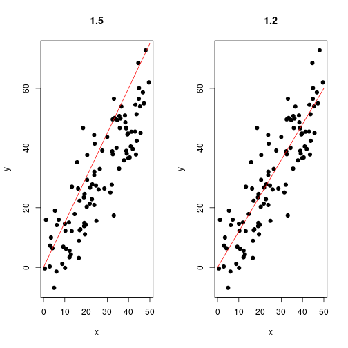

# Want to play a game?

---

# Great!

This game is called _Guess the slope_, as your job is to identify the slope of a regression line for randomly generated points.

You can play the game at https://sashee.shinyapps.io/coursera-course-project .

Your progress are tracked during your session, so you can try to beat your best every time you play!

---

# How to play

Use the slider to adjust the line until you see fit.

 

---

# Submitting

If you think the slope is set to the correct value, press _Submit_, and you'll instantly know whether you are right or not.

# Have fun!
